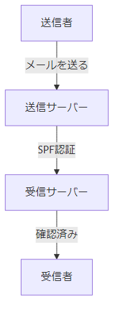
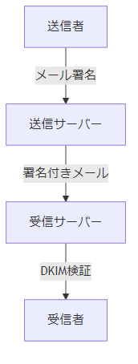

# メールの安全性を守る仕組み

**著者**: ITサポーター・ＭＫ  
**日付**: 2025年1月17日

---

## 目次

1. メールの仕組みとは？  
2. SPFとは？  
3. DKIMとは？  
4. DMARCとは？  
5. まとめ  

---

## メールの仕組みとは？

- メールは手紙のようなもの。
- 送り手、受け取り手、配達人がいます。
- しかし、偽物の送り手を名乗る人がいるかも！

  
📝 手紙: メールの内容

  
📤 送り手: メールを送信する人

  
📥 受け取り手: メールを受信する人

  
🚚 配達人: メールサーバー

---

## SPFとは？

- **SPF (Sender Policy Framework)** は「このサーバーから送られたメールは本物だよ！」と証明する仕組み。
- 郵便でいう「正規の配達員」です。
- SPFが正しいと、偽物の送り手をブロックできます。

---

<!-- style: "img { display: block; margin: 0 auto; }" -->

---

## DKIMとは？

- **DKIM (DomainKeys Identified Mail)** は、メールに「送り主の署名」を付ける仕組み。
- 郵便でいう「送り主の封印」です。
- DKIMが正しいと、「内容が改ざんされていない」ことが分かります。

---

<!-- style: "img { display: block; margin: 0 auto; }" -->

---

## DMARCとは？

- **DMARC** はSPFとDKIMをまとめて使う仕組み。
- 郵便でいう「配達確認サービス」。
- メールが正しく認証されていない場合、どう処理するかを指定できます。

---

<!-- style: "img { display: block; margin: 0 auto; }" -->

---

## まとめ

- SPF：正規の配達員かチェック。
- DKIM：送り主の署名で内容を守る。
- DMARC：SPFとDKIMを使い、偽物をブロック。

### メールセキュリティプロトコルの比喩

- **SPF** = 配達員の正当性
- **DKIM** = 封筒の封印  
- **DMARC** = 配達確認

